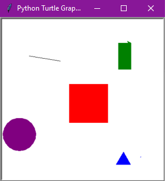

# Paint Game
 Repository for a Paint game, programmed with Python.
 
## Table of Contents
* [General info](#general-info)
* [Technologies](#technologies)
* [Setup](#setup)
* [Status](#status)
* [Inspiration](#inspiration)

## General info
This is repository contains a Paint. Use your keyboard to draw different shapes such as circles, triangles, squares, lines and rectangles.
With this code it is posible to choose a color for the shapes, typing a letter is the only requirement (Follow the same logic to choose a figure).
Example: Type 'P' and 's', the result is a purple square.
It must look like this when your run the code:



## Technologies
* Python 3.7.7
* Freegames 2.3.2
* Turtle and random were included with Python.

## Setup
To properly run (and play) this game, you'll need to import some Python packages: freegames and turtle.
As seen on this part of the code:

```Python
from turtle import *
from freegames import vector
```

## Status
This code is already finished.

## Inspiration
This proyect is inspired by the Paint game code at [Grant Jenks](http://www.grantjenks.com/docs/freegames/paint.html) website.

## Collaborators
* [Edgar Castillo](https://github.com/EdgarCastilloRm)
* [Luis Martínez](https://github.com/A01570852)
